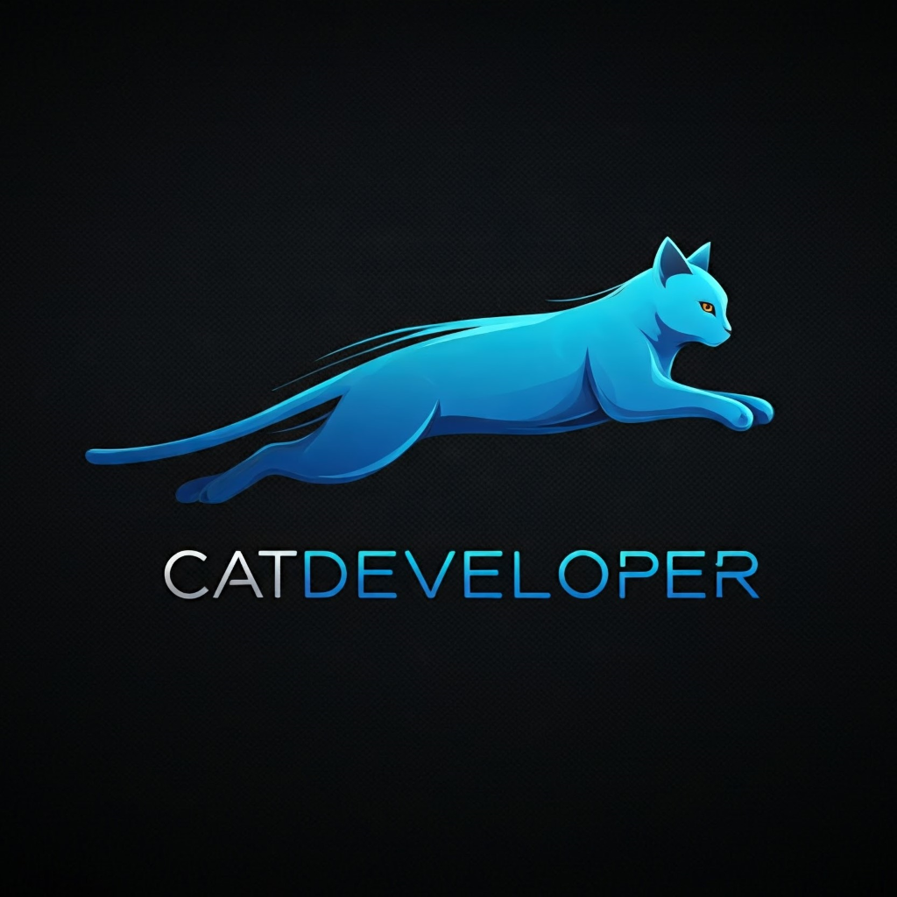

# Aplikacja Paint by CatDeveloper v1.2

Witamy w aplikacji Paint v1.2 stworzonej przez CatDeveloper! To prosty, lecz funkcjonalny program do rysowania, idealny dla początkujących i tych, którzy potrzebują szybkiego i łatwego w użyciu narzędzia do tworzenia rysunków. Został napisany w języku Python z wykorzystaniem bibliotek Tkinter (interfejs użytkownika), Matplotlib (rysowanie) i Pillow (obsługa obrazów).

## Funkcjonalność:

* **Intuicyjne rysowanie:** Tworzenie rysunków za pomocą myszki jest proste i intuicyjne. Wystarczy kliknąć i przeciągać, aby narysować linię.
* **Bogata paleta kolorów:** Aplikacja oferuje szeroką gamę kolorów do wyboru, zapewniając elastyczność w tworzeniu różnorodnych rysunków. Paleta kolorów jest przewijana za pomocą wygodnego suwaka, a przyciski kolorów są teraz większe i łatwiejsze w użyciu.
* **Regulacja grubości linii:** Możesz dostosować grubość linii za pomocą suwaka, aby uzyskać pożądany efekt wizualny.
* **Gumka:**  Wygodna gumka pozwala na usuwanie elementów rysunku.
* **Zapisywanie w różnych formatach:** Zapisz swoje dzieła w popularnych formatach PNG i JPG, aby móc je łatwo udostępniać i wykorzystywać w innych aplikacjach.
* **Funkcja czyszczenia rysunku:** Szybko i łatwo wyczyść obszar rysowania, zachowując ewentualnie załadowany obraz.
* **Funkcja czyszczenia obrazu:** Wyczyść cały obraz, usuwając wszystkie elementy rysunku i załadowany obraz.
* **Tworzenie nowego obrazu:** Utwórz nowy, pusty obraz o dowolnych wymiarach.
* **Otwieranie obrazów:** Otwórz istniejące obrazy w formatach JPG i PNG, aby na nich dalej rysować.
* **Prosty i czytelny interfejs:** Interfejs użytkownika został zaprojektowany tak, aby był prosty i intuicyjny, zapewniając komfortowe korzystanie z aplikacji.  Interfejs został podzielony na sekcje "Narzędzia" i "Zarządzanie obrazem" dla lepszej organizacji.

## Ważne informacje:

* **Plik `kolory.json`:** Aplikacja korzysta z pliku `kolory.json` do przechowywania palety kolorów. **Każda, nawet najmniejsza, ręczna modyfikacja tego pliku może spowodować uszkodzenie aplikacji.** Jeśli wystąpią problemy, usuń plik `kolory.json` – aplikacja automatycznie wygeneruje nowy plik z domyślną paletą kolorów podczas kolejnego uruchomienia.

## Pobierz aplikację:

[Pobierz aplikację](https://www.dropbox.com/scl/fo/h7svuj973ey5jd2j3as2w/ANGB-UX-fK9evV_axhd43IY?rlkey=rn7vrwyg0t98aklkphc9og36f&st=88cbzlr6&dl=0) 

## Autor:

CatDeveloper

  

---

  <small>v1.2</small>

