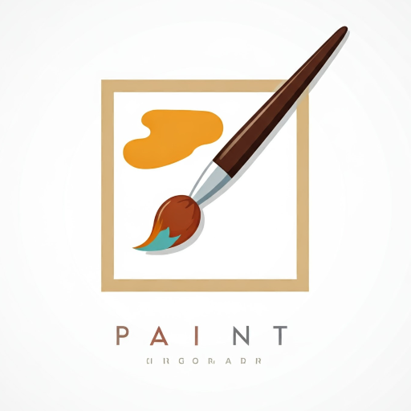

# Aplikacja Paint by CatDeveloper

Witamy w aplikacji Paint stworzonej przez CatDeveloper! To prosty, lecz funkcjonalny program do rysowania, idealny dla początkujących i tych, którzy potrzebują szybkiego i łatwego w użyciu narzędzia do tworzenia rysunków.  Został napisany w języku Python z wykorzystaniem bibliotek Tkinter (interfejs użytkownika) i Matplotlib (rysowanie).

## Funkcjonalność:

* **Intuicyjne rysowanie:** Tworzenie rysunków za pomocą myszki jest proste i intuicyjne.  Wystarczy kliknąć i przeciągać, aby narysować linię.
* **Bogata paleta kolorów:** Aplikacja oferuje szeroką gamę kolorów do wyboru, zapewniając elastyczność w tworzeniu różnorodnych rysunków.  Paleta kolorów jest przewijana za pomocą wygodnego suwaka.
* **Regulacja grubości linii:** Możesz dostosować grubość linii, aby uzyskać pożądany efekt wizualny.
* **Zapisywanie w różnych formatach:**  Zapisz swoje dzieła w popularnych formatach PNG i JPG, aby móc je łatwo udostępniać i wykorzystywać w innych aplikacjach.
* **Funkcja czyszczenia:**  Szybko i łatwo wyczyść cały obszar rysowania jednym kliknięciem.
* **Prosty i czytelny interfejs:**  Interfejs użytkownika został zaprojektowany tak, aby był prosty i intuicyjny, zapewniając komfortowe korzystanie z aplikacji.

## Ważne informacje:

* **Plik `kolory.json`:** Aplikacja korzysta z pliku `kolory.json` do przechowywania palety kolorów.  **Każda, nawet najmniejsza, ręczna modyfikacja tego pliku może spowodować uszkodzenie aplikacji.** Jeśli wystąpią problemy, usuń plik `kolory.json` – aplikacja automatycznie wygeneruje nowy plik z domyślną paletą kolorów podczas kolejnego uruchomienia.

## Pobierz aplikację:

[Pobierz aplikację](https://drive.google.com/file/d/1-1T9m5MMx3HQ-O6t5g74IRywUm-XBjum/view?usp=sharing)

## Autor:

CatDeveloper

---

  <small>v1.0</small>

